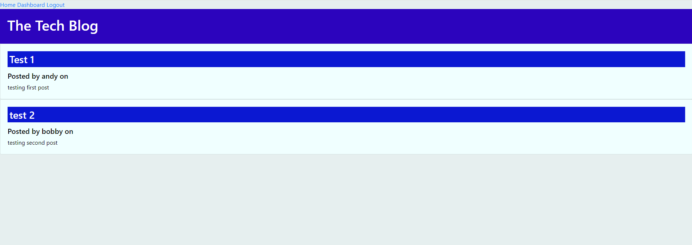

# mvc-tech-blog 

[Link to Walkthrough Video](#)

## Technology Used:

 * npm - https://www.npmjs.com/
 * mysql2 - https://www.npmjs.com/package/mysql2
 * sequelize - https://sequelize.org/
 * express - https://expressjs.com/
 * express-handlebar - https://www.npmjs.com/package/express-handlebars
 * express-session - https://www.npmjs.com/package/express-session
 * dotenv - https://www.npmjs.com/package/dotenv
 * handlebars - https://handlebarsjs.com/
 * bcrypt - https://www.npmjs.com/package/bcrypt
 * sequelize - https://sequelize.org/

 ## Description

  This application is is a CMS-Style blog site. It allows a user to publish articles, posts, and comments.

 ## Table of Contents
  
   * [Installation](#installation)
   * [Usage](#usage)
   * [License](#license)
   * [Badges](#badges)
   * [Tests](#tests)
   * [Contributing](#contributing)
   * [Credits](#credits)

## Installation
  
* To install all dependences, run: npm install
* Create the database in MYSQL using the schema.sql.
* To load the seeds into the database, run: npm run seed 
* To start the server, run: node server.js

## Usage

When the application is started. you are presented with the HOME page.  which displays all user posts. To do anything, you must login first. select any link and it will redirect you login page.
if you dont have a login. you can signup and create a username and password.  once your logged in, you will be directed to the user dashboard, which display just the user post, and allows them to create new posts.

below are a few code snippets:

sessions:

    const sess = {
    secret: 'secret', //process.env.DB_SESSION_SECRET,
        cookie: {
            maxAge: 3600000, //1hr
            resave: false,
            saveUninitialized: true,
            store: new SequelizeStore({
            db: sequelize,
        }),
    },
    };

Handlebars

    const hbs = exphbs.create({ helpers });
    app.engine('handlebars', hbs.engine);
    app.set('view engine', 'handlebars');

    {{#each posts}}
    <section class="card">
    <a href="/posts/{{id}}" class="card-body">
        <h3 class="card-title">{{title}}</h3> 
        <h5>Posted by {{user.username}} on {{createdAt}}</h5>
        
{{description}}

    </a>
    </section>
    {{/each}}

require login or redirect

        if (!req.session.logginIn) {
        res.redirect('/login');}
 

## License

 This project is licensed with MIT license

 Link to License - [Website to MIT License]((https://opensource.org/license/mit))

 ## Badges

 

 ## Tests
 
 This application does not have any tests

 ## Contributing

 Contact me if you interested in contributing:

 Check out my [github](https://github.com/AZurek17) page or send me a [email](mailto:andyzurek@gmail.com)

 ## Credits
 * Tutoring Session
 * ChatGPT
 * StudyGroup

 &copy;2023, Written by Andy Zurek